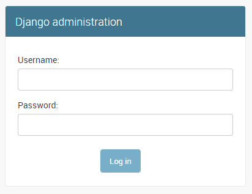

# Django 管理员界面

Django为管理活动提供随时可以使用的用户界面。我们都知道，管理界面对于一个Web项目是十分重要的。Django根据您的项目模型自动生成管理界面。  

## 启动管理员界面 

Django会默认开启管理员界面，但我们还是来一步步了解下，这都需要哪些配置的支持。

[前置环境准备](./project.html)

### 检查依赖

管理界面依赖于 django.contrib 模块。若需它工作，需要确保一些模块是否导入在 myproject/settings.py 文件中的INSTALLED_APPS和MIDDLEWARE_CLASSES元组。 

```bash
cat ~/myproject/myproject/settings.py
```

 INSTALLED_APPS应有:

```python
'django.contrib.admin',
'django.contrib.auth',
```

 MIDDLEWARE_CLASSES 应有 

```python
MIDDLEWARE_CLASSES = (
   'django.contrib.sessions.middleware.SessionMiddleware',
   'django.middleware.common.CommonMiddleware',
   'django.middleware.csrf.CsrfViewMiddleware',
   'django.contrib.auth.middleware.AuthenticationMiddleware',
   'django.contrib.messages.middleware.MessageMiddleware',
   'django.middleware.clickjacking.XFrameOptionsMiddleware',
)
```

### 初始化数据库

在启动服务器，我们来访问管理界面，可能还需要启动数据库

```bash
python3 ~/myproject/manage.py migrate
```

### 设置管理员用户名及密码

如果你已经有一个超级用户或忘记了密码，可以用下面的代码来直接创建一个

```bash
python3 ./myproject/manage.py createsuperuser 
```

`Superuser created successfully.`

现在就开始启动管理界面，我们需要确保已经为管理界面配置URL。

```bash
cat ~/myproject/myproject/urls.py
```

其中应该有这样的东西

```bashbsh
urlpatterns = [
    url(r'^admin/', admin.site.urls),
]
```

### 启动服务

现在，只需使用下面的命令运行启动服务器。 

```bash
python3 ~/myproject/manage.py runserver 0.0.0.0:80
```

## 访问项目

使用浏览器打开:`{host0.http_url}admin`



输入刚刚设置的用户名，密码登陆后，进入管理界面。
