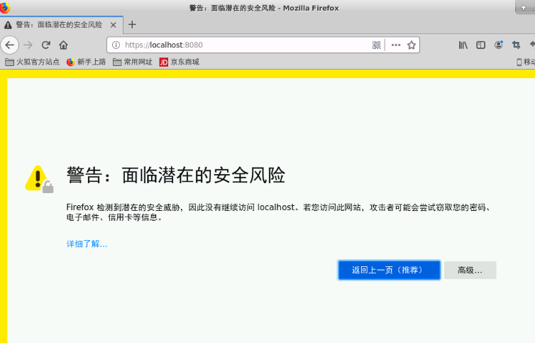
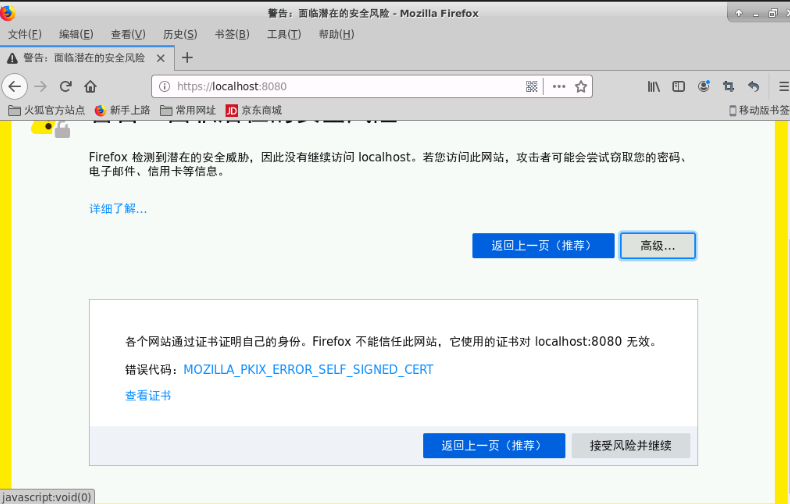
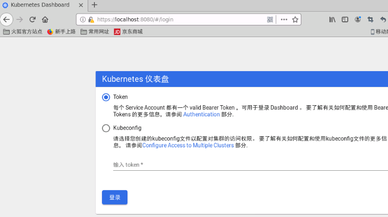
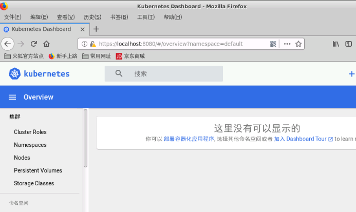

# Kubernetes Dashboard

仪表板Dashboard是基于Web的Kubernetes用户界面。您可以使用仪表板将容器化的应用程序部署到Kubernetes集群，对容器化的应用程序进行故障排除以及管理集群资源。您可以使用Dashboard来概述集群上运行的应用程序，以及创建或修改单个Kubernetes资源（例如Deployments，Jobs，DaemonSets等）。例如，您可以使用部署向导来扩展部署，启动滚动更新，重新启动Pod或部署新应用程序。

仪表板还提供有关集群中Kubernetes资源状态以及可能发生的任何错误的信息。


## 部署 Dashboard
默认情况下，仪表板用户界面未部署。要部署它，请运行以下命令：

更新k8s默认端口范围

```bash
sed -i  '17i\    - --service-node-port-range=8080-30553' /etc/kubernetes/manifests/kube-apiserver.yaml 
```

导入Dashboard所需镜像

```bash
ctr -n k8s.io i import /share/lesson/kubernetes/kubernetesui.dashboard\:v2.0.0.tar 
ctr -n k8s.io i import /share/lesson/kubernetes/kubernetesui.metrics-scraper\:v1.0.4.tar 
```

部署Dashboard

```bash
kubectl create -f /share/lesson/kubernetes/dashboard-v2.0.0-aio-deploy-recommended.yaml 
```

部署FireFox浏览器

```bash
 cp /share/tar/Firefox-latest-x86_64.tar.bz2 .
 tar xvf Firefox-latest-x86_64.tar.bz2 
```

在实验区右侧+号，弹出的VNC桌面中,新建一个Terminal，然后执行

```bash
~/firefox/firefox
```

在弹出的FireFox浏览器的地址栏中输入

`https://localhost:8080`


在弹出的页面选择高级中的接受风险并继续



进入到Dashboard的登陆页面



选择Token登陆

Token的值通过以下命令获取`Token:`字段

```bash
kubectl -n kubernetes-dashboard describe secret $(kubectl -n kubernetes-dashboard get secret | grep admin-user | awk '{print $1}')
```
成功登陆后的界面
