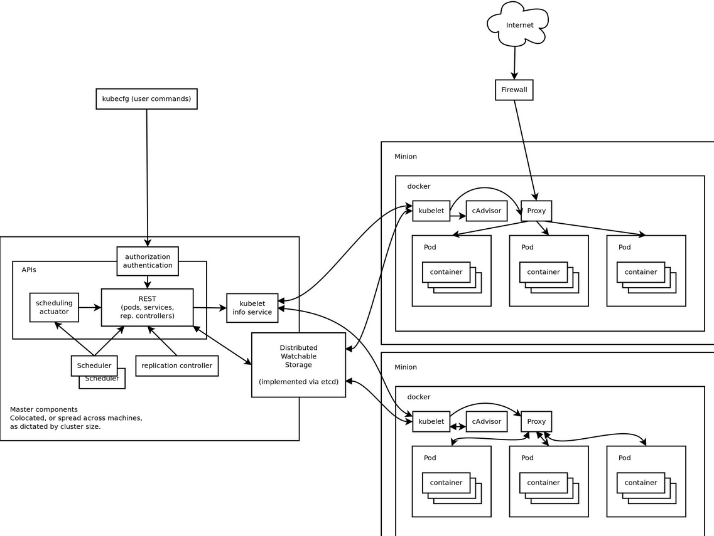

# Kubernetes 介绍

Docker 开启了容器时代，而 Kubernetes 则革新了我们对于云计算，软件开发流程，业务平台等等方面的认知。 Docker 给我们带来了更为简便好用的工具，而 Kubernetes 则促使我们重新思考我们的软件架构方式。

**先看一段有趣的关于Kuberntes的动画介绍：**

<iframe src="//player.bilibili.com/player.html?aid=10087636&bvid=BV1ex411U7K6&cid=16669885&page=1" scrolling="no" border="0" frameborder="no" framespacing="0" allowfullscreen="true" width=100% height=500> </iframe>

Kubernetes是Google开源的一款容器编排工具，它是诞生在Google内部运行N多年的博格系统之上的产物，因此其成熟度从其诞生初期就广泛受到业界的关注，并且迅速成为编排工具市场的主流，其社区活跃度非常高，版本迭代速度也很惊人，它的主要作用是对Docker容器做编排工作，当然，Docker只是容器工具的一种引擎，K8s可支持多种容器引擎，但从目前来说Docker容器引擎是具有绝对优势的，容器需要编排，也很容易理解，因为我们最核心要跑到业务通常都是LNMT/P的不同形式的扩展，但NMT/P他们的运行是有先后顺序的，也就是说MySQL要先启动，然后是Tomcat或PHP，最后是Nginx，而控制这种顺序就需要有容器编排工具来帮我们实现.

另外，我们的业务希望7x24小时在线，如何保障？靠人是很难做到实时的，但编排工具可以，K8s帮我们实现了很多控制器，这控制器可以帮我们监控容器运行的状态，并自动帮我们重建(在容器时代重启就是重建)容器，并且还可以在容器处理能力不足时，自动根据我们定义的扩展规则，自动创建新Pod(k8s中最小单元,每个Pod中可有一个或多个容器)，并且在压力下去后，自动删除Pod等等功能。

可监控系统的资源使用情况，进行容器的自动增加或者收缩，这就是所谓的容器编排

kubernetes:舵手，飞行员，参考谷歌内部的大规模内部容器调度系统Borg实现，使用Go语言开发。代码托管在github上，链接：https://github.com/kubernetes/kubernetes.

## k8s特性如下：

1.自动装箱，自动容器的部署，不影响可用性

2.自我修复，如容器崩溃后快速重新启动新的容器

3.自动实现水平扩展

4.自动实现服务发现和负载均衡

5.自动发布和回滚

6.支持密钥和配置管理，把应用程序的配置信息通过服务来加载，而不是加载本地的配置。实现配置的统一

7.实现存储编排

8.任务的批处理运行

## k8s集群架构如下

总体架构

k8s的集群至少有两个主机组成：master + node ,即为master/node架构，master为集群的控制面板，master主机需要做冗余，一般建议为3台，而node主机不需要，因为node的主要作用是运行pod，贡献计算能力和存储能力，而pod控制器会自动管控pod资源，如果资源少，pod控制器会自动创建pod，即pod控制器会严格按照用户指定的副本来管理pod的数量。客户端的请求下发给master,即把创建和启动容器的请求发给master,master中的调度器分析各node现有的资源状态，把请求调用到对应的node启动容器。

可以理解为k8s把容器抽象为pod来管理1到多个彼此间有非常紧密联系的容器，但是LAMP的容器主机A,M,P只是有关联，不能说是非常紧密联系，因此A,M,P都要运行在三个不同的pod上。

在k8s中，要运行几个pod，是需要定义一个配置文件，在这个配置文件里定义用哪个控制器启动和控制几个pod，在每个pod里要定义那几台容器，k8s通过这个配置文件，去创建一个控制器，由此控制器来管控这些pod,如果这些pod的某几个down掉后，控制器会通过健康监控功能，随时监控pod，发现pod异常后,根据定义的策略进行操作，即可以进行自愈。

k8s内部需要5套证书，手动创建或者自动生成，分别为，etcd内部通信需要一套ca和对应证书，etcd与外部通信也要有一套ca和对应证书。APIserver间通信需要一套证书，apiserver与node间通信需要一套证书，node和pod间通信需要一套ca

目前而言，还不能实现把所有的业务都迁到k8s上，如存储，因为这个是有状态应用，出现错误排查很麻烦，目前而且，k8s主要是运行无状态应用。

所以一般而言，负载均衡器运行在K8s之外，nginx或者tomcat这种无状态的应用运行于k8s集群内部，而数据库，如mysql，zabbix，zoopkeeper，有状态的，一般运行于k8s外部，通过网络连接，实现k8s集群的pod调用这些外部的有状态应用。