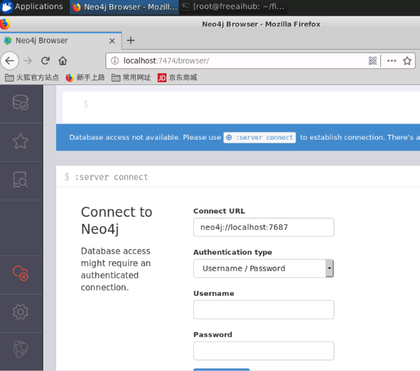
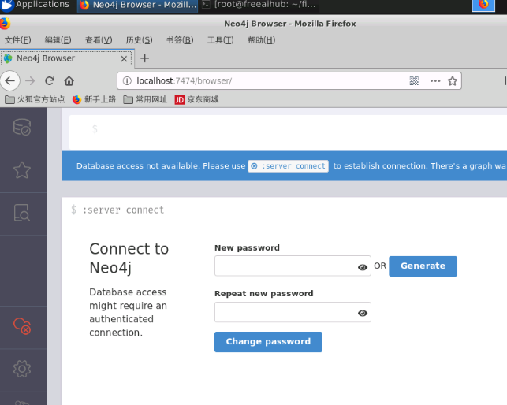
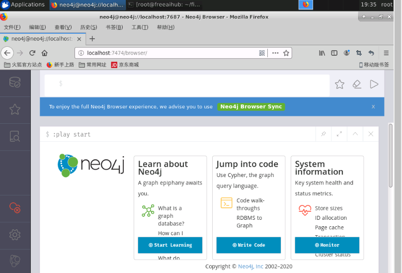

# Neo4j 环境安装及配置

## 本课程在线环境的安装

**安装JDK 11**

```bash
#复制JDK相关文件
cp /share/tar/jdk-11.0.6_linux-x64_bin.tar.gz  /usr/local/
#对文件进行解压缩，-C 指定解压后，将文件放到/usr/local目录下
tar -xzvf /usr/local/jdk-11.0.6_linux-x64_bin.tar.gz -C /usr/local/
mv /usr/local/jdk-11.0.6 /usr/local/java

#配置相关环境变量
echo 'export JAVA_HOME=/usr/local/java' >> ~/.bashrc
echo 'export PATH=$JAVA_HOME/bin:$PATH' >> ~/.bashrc
source ~/.bashrc  #生效环境变量
#验证java安装，测试环境变量是否配置正确。如果出现正确的版本信息提示，则安装成功
java -version
```

**安装Neo4j**

```bash
cp /share/tar/neo4j-community-4.0.3-unix.tar.gz /usr/local
#对文件进行解压缩，-C 指定解压后，将文件放到/usr/local目录下
tar -xzvf /usr/local/neo4j-community-4.0.3-unix.tar.gz -C /usr/local/
mv /usr/local/neo4j-community-4.0.3 /usr/local/neo4j

#下面来修改环境变量：系统环境变量或用户环境变量。
echo 'export PATH=/usr/local/neo4j/bin:$PATH' >> ~/.bashrc
source ~/.bashrc  #生效环境变量
#验证neo4j安装，测试环境变量是否配置正确。如果出现正确的版本信息提示，则安装成功
neo4j version
```

```bash
#启动服务并查看状态
neo4j restart  && neo4j status
```

**Neo4j数据浏览器**

配置好后，我们可以使用以下UR，或点击加号在弹出的界面中选择vnc桌面环境，使用浏览器打开localhost:7474即可打开Neo4j数据浏览器。

注意：neo4j的启动可能需要两到三分钟的时间，请耐心等待。

在弹出的页面中，用户名username和密码password均填写为neo4j即可。



接下来是重置neo4j的连接密码，为学习方便可以写一个简单的密码。



此处进行neo4j数据浏览器的真正界面了。



Neo4j数据浏览器用于执行CQL命令并查看输出。

在这里，我们需要在美元提示符下执行所有CQL命令：**“ $”**

在美元符号后键入命令，然后单击“执行”按钮以运行命令。

它与Neo4j数据库服务器进行交互，检索并在美元提示下方显示结果。

使用“ VI查看”按钮以图表格式查看结果。上图以“ UI视图”格式显示了结果。

使用“网格视图”按钮在网格视图中查看结果。下图以“网格视图”格式显示了相同的结果。


这里请务必多多熟悉，后边的课程中均会基于数据浏览器进行。