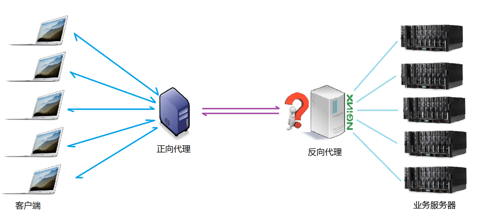

# Nginx 示例9:负载均衡(load balance)

我们已经明确了所谓代理服务器的概念，那么接下来，Nginx扮演了反向代理服务器的角色，它是以依据什么样的规则进行请求分发的呢？不用的项目应用场景，分发的规则是否可以控制呢？

这里提到的客户端发送的、Nginx反向代理服务器接收到的请求数量，就是我们说的负载量。

请求数量按照一定的规则进行分发到不同的服务器处理的规则，就是一种均衡规则。

所以，将服务器接收到的请求按照规则分发的过程，称为负载均衡。

负载均衡在实际项目操作过程中，有硬件负载均衡和软件负载均衡两种，硬件负载均衡也称为硬负载，如F5负载均衡，相对造价昂贵成本较高，但是数据的稳定性安全性等等有非常好的保障，如中国移动中国联通这样的公司才会选择硬负载进行操作；更多的公司考虑到成本原因，会选择使用软件负载均衡，软件负载均衡是利用现有的技术结合主机硬件实现的一种消息队列分发机制。

## Nginx支持的负载均衡调度算法方式如下：

1. weight轮询(默认，常用)：接收到的请求按照权重分配到不同的后端服务器，即使在使用过程中，某一台后端服务器宕机，Nginx会自动将该服务器剔除出队列，请求受理情况不会受到任何影响。 这种方式下，可以给不同的后端服务器设置一个权重值(weight)，用于调整不同的服务器上请求的分配率；权重数据越大，被分配到请求的几率越大；该权重值，主要是针对实际工作环境中不同的后端服务器硬件配置进行调整的。
2. ip_hash（常用）：每个请求按照发起客户端的ip的hash结果进行匹配，这样的算法下一个固定ip地址的客户端总会访问到同一个后端服务器，这也在一定程度上解决了集群部署环境下session共享的问题。
3. fair：智能调整调度算法，动态的根据后端服务器的请求处理到响应的时间进行均衡分配，响应时间短处理效率高的服务器分配到请求的概率高，响应时间长处理效率低的服务器分配到的请求少；结合了前两者的优点的一种调度算法。但是需要注意的是Nginx默认不支持fair算法，如果要使用这种调度算法，请安装upstream_fair模块。
4. url_hash：按照访问的url的hash结果分配请求，每个请求的url会指向后端固定的某个服务器，可以在Nginx作为静态服务器的情况下提高缓存效率。同样要注意Nginx默认不支持这种调度算法，要使用的话需要安装Nginx的hash软件包。