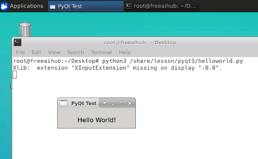

# PyQt 环境安装及配置

## 本课程在线环境的安装

### 打开终端

在右侧桌面环境空白处，右键打开`Open Terminal Here`

### 安装PyQt4环境
```shell
#更新apt安装源
#安装PyQt4环境,安装补充PyQt4.QtSQL包,安装mysql,sqlite驱动,安装PyQt4 Designer
apt update && apt install python3-pyqt4 python3-pyqt4.qtsql libqt4-sql-mysql libqt4-sql-sqlite qt4-designer -y
```

### 验证环境

在右侧的实验区，打开一个终端，运行试试

```bash
python3 /share/lesson/pyqt5/helloworld.py
```

